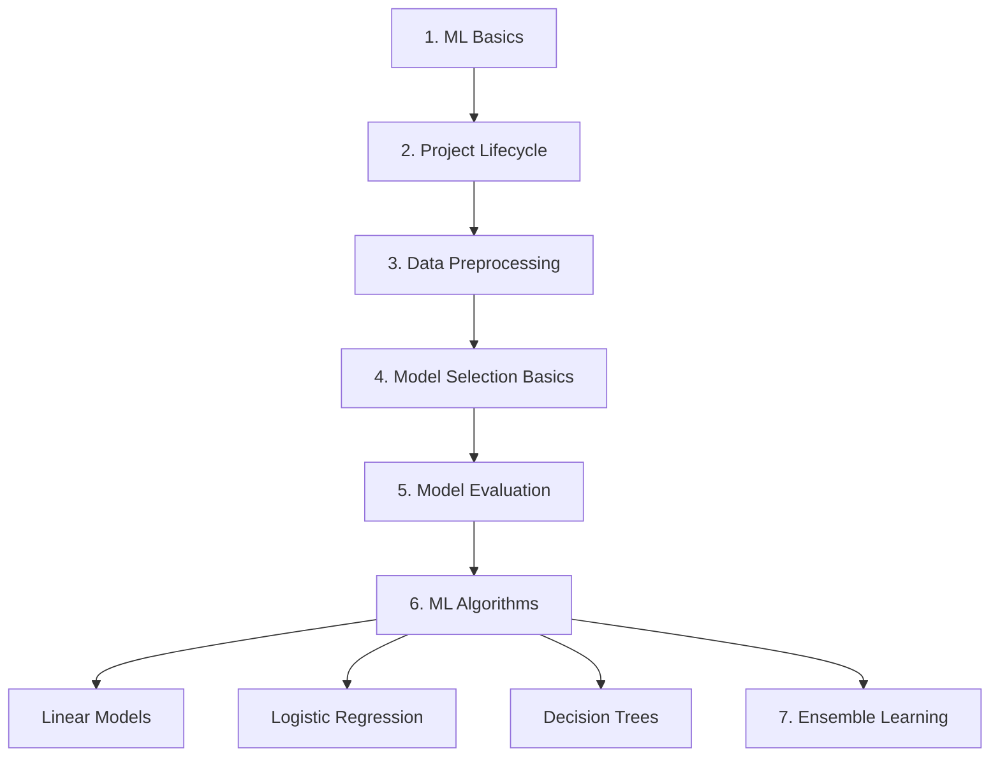

# 🤖 Machine Learning Roadmap

> Complete Table of Contents — Beginner to Advanced

---

## 📋 Quick Navigation

| # | Part | Status |
|---|------|--------|
| 1 | [Machine Learning Basics](#part-1--machine-learning-basics) | ✅ Complete |
| 2 | [ML Project Lifecycle](#part-2--machine-learning-project-lifecycle) | ✅ Complete |
| 3 | [Data Preprocessing](#part-3--data-preprocessing) | ✅ Complete |
| 4 | [Model Selection Basics](#part-4--model-selection-basics) | ✅ Complete |
| 5 | [Model Evaluation](#part-5--model-evaluation) | ✅ Complete |
| 6 | [Machine Learning Algorithms](#part-6--machine-learning-algorithms) | ✅ Complete |
| 7 | [Ensemble Learning](#part-7--ensemble-learning) | ✅ Complete |

---

## Part 1 — Machine Learning Basics

### 1.1 Machine Learning Introduction
- What is Machine Learning?
- Real-Life Examples of ML
- Types of Machine Learning
  - Supervised Learning
  - Unsupervised Learning
  - Reinforcement Learning

---

## Part 2 — Machine Learning Project Lifecycle

### 2.1 ML Workflow
- Problem Definition
- Data Collection
- Data Preprocessing
- Model Selection
- Model Training
- Model Evaluation
- Model Optimization
- Deployment Strategies

---

## Part 3 — Data Preprocessing

### 3.1 Data Understanding
- Initial EDA
- Dataset Shape
- Data Types
- Categorical vs Numerical Features
- Statistical Summary
- Data Visualization
  - Histogram
  - Scatter Plot
  - Pair Plot

### 3.1.1 Data Cleaning — Missing Values
- Detect Missing Values
- Missing Percentage
- Missing Value Visualization

**Missing Value Handling**

Removal Methods

- Row Deletion
- Column Deletion
- Selective Deletion

Numerical Imputation

- Mean Imputation
- Median Imputation
- Mode Imputation
- Conditional Mean
- KNN Imputation
- Regression Imputation

Categorical Imputation

- Mode Imputation
- New Category ("Missing")
- Most Frequent Value
- Machine Learning-Based Imputation

---

### 3.2 Outlier Detection & Treatment

**Detection Methods**
- Z-Score
- IQR Method
- Box Plot
- Scatter Plot
- Standard Deviation

**Handling Methods**
- Remove Outliers
- Winsorization
- Capping
- Log Transformation
- Domain Knowledge

---

### 3.3 Data Consistency & Standardization

**Text Cleaning**
- Convert to Lowercase
- Remove Extra Spaces
- Remove Special Characters
- Unicode Normalization
- Spelling Correction

**Numerical Scaling**
- Min-Max Scaling
- Standard Scaling
- Robust Scaling
- Log Transformation
- Power Transformation

---

### 3.4 Data Transformation

**Encoding Techniques**
- One-Hot Encoding
- Label Encoding
- Target Encoding
- Frequency Encoding

**Numerical Transformation**
- Standardization
- Min-Max Scaling
- Robust Scaling
- Log Transformation
- Square Root Transformation
- Polynomial Transformation

**Feature Engineering**
- Polynomial Features
- Binning
- Interaction Features
- Date Feature Extraction
- Aggregation Features

---

### 3.5 Feature Selection

**Filter Methods**
- Correlation Analysis
- Chi-Square Test
- ANOVA

**Wrapper Methods**
- Recursive Feature Elimination (RFE)
- Forward Selection
- Backward Selection

**Embedded Methods**
- Lasso
- Ridge
- Random Forest Feature Importance

---

### 3.6 Dimensionality Reduction
- Principal Component Analysis (PCA)
- Linear Discriminant Analysis (LDA)
- t-SNE
- UMAP
- Autoencoders

---

### 3.7 Data Splitting
- Train/Test Split
- Validation Set
- Stratified Sampling
- Cross Validation

---

### 3.8 Advanced Preprocessing

**Imbalanced Data Handling**
- SMOTE
- Random Undersampling
- Class Weights

**Time Series Preprocessing**
- Resampling
- Lag Features
- Rolling Window Features

---

## Part 4 — Model Selection Basics

### 4.1 Machine Learning Problems
- Classification
  - Binary Classification
  - Multiclass Classification
- Regression

---

## Part 5 — Model Evaluation

### 5.1 Classification Metrics
- Accuracy
- Precision
- Recall
- F1 Score
- Confusion Matrix
- ROC Curve
- AUC

### 5.2 Regression Metrics
- Mean Absolute Error (MAE)
- Mean Squared Error (MSE)
- Root Mean Squared Error (RMSE)
- R² Score

---

## Part 6 — Machine Learning Algorithms

### 6.1 Linear Models
- Linear Regression
- Ridge Regression
- Lasso Regression
- Elastic Net Regression

---

### 6.2 Logistic Regression

**Fundamentals**
- Introduction
- Sigmoid Function
- Log Loss

**Types**
- Binary Logistic Regression
- Multinomial Logistic Regression
- Ordinal Logistic Regression
- Regularized Logistic Regression

**Comparison**
- Logistic Regression vs Linear Regression

---

### 6.3 Decision Trees

**Fundamentals**
- Decision Tree Basics
- Entropy
- Gini Impurity
- Information Gain

**Types**
- Categorical Decision Trees
- Numerical Decision Trees
- Mixed Decision Trees

**Hyperparameters**
| Parameter | Purpose |
|---|---|
| `criterion` | Split quality measure (gini/entropy) |
| `max_depth` | Maximum tree depth |
| `min_samples_split` | Min samples to split a node |
| `min_samples_leaf` | Min samples per leaf |
| `max_features` | Features considered per split |
| `max_leaf_nodes` | Max number of leaf nodes |
| `min_impurity_decrease` | Min impurity decrease to split |
| `splitter` | Split strategy (best/random) |
| `random_state` | Reproducibility seed |
| `class_weight` | Handle imbalanced classes |

**Model Behavior**
- Overfitting
- Underfitting

**Regression Trees**
- DecisionTreeRegressor
- Sum of Squared Errors (SSE)
- Tree Splitting
- House Rent Prediction Example

---

## Part 7 — Ensemble Learning

### 7.1 Ensemble Learning Fundamentals
- Diversity of Models
- Wisdom of Crowds

**Bagging**
- Random Forest

**Boosting**
- AdaBoost
- Gradient Boosting
- XGBoost
- LightGBM
- CatBoost
- Stochastic Gradient Boosting

**Stacking**

**Voting**
- Hard Voting
- Soft Voting

---

## 📈 Learning Sequence

1. Machine Learning Basics
2. Machine Learning Project Lifecycle
3. Data Preprocessing
4. Model Selection Basics
5. Model Evaluation
6. Machine Learning Algorithms
   - Linear Models
   - Logistic Regression
   - Decision Trees
7. Ensemble Learning

---

⭐ *If this roadmap helped you, consider giving the repo a star!*