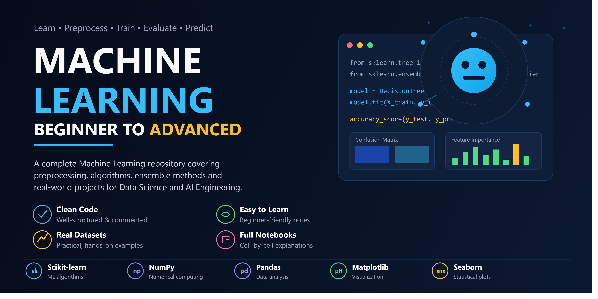

<p align="center">
 
</p>

<p align="center">
  
  
  
  
  
  
  
</p>

# 🤖 Machine Learning Beginner to Advanced

A complete Machine Learning learning repository covering ML fundamentals, the full project lifecycle, Data Preprocessing, Model Selection, Model Evaluation, Machine Learning Algorithms, and Ensemble Learning.

This repository documents a structured Machine Learning learning journey with clean notes, well-commented code, and beginner-friendly explanations that gradually progress from ML basics toward advanced ensemble techniques used in Data Science and AI Engineering.

---

## 📚 Topics Covered

### Machine Learning Basics
- What is Machine Learning?
- Real-Life Examples of ML
- Types of Machine Learning
  - Supervised Learning
  - Unsupervised Learning
  - Reinforcement Learning

---

### Machine Learning Project Lifecycle
- Problem Definition
- Data Collection
- Data Preprocessing
- Model Selection
- Model Training
- Model Evaluation
- Model Optimization
- Deployment Strategies

---

### Data Preprocessing
- Exploratory Data Analysis (EDA)
- Data Cleaning
  - Missing Value Detection & Visualization
  - Missing Value Handling (Removal, Imputation)
- Outlier Detection & Treatment
- Data Consistency & Standardization
- Data Transformation
  - Encoding Techniques (One-Hot, Label, Target, Frequency)
  - Numerical Transformation & Scaling
  - Feature Engineering
- Feature Selection (Filter, Wrapper, Embedded Methods)
- Dimensionality Reduction (PCA, LDA, t-SNE, UMAP)
- Data Splitting & Cross Validation
- Advanced Preprocessing (Imbalanced Data, Time Series)

---

### Model Selection Basics
- Classification (Binary & Multiclass)
- Regression

---

### Model Evaluation
- Classification Metrics: Accuracy, Precision, Recall, F1 Score, Confusion Matrix, ROC-AUC
- Regression Metrics: MAE, MSE, RMSE, R² Score

---

### Machine Learning Algorithms

#### Linear Models
- Linear Regression
- Ridge Regression
- Lasso Regression
- Elastic Net Regression

#### Logistic Regression
- Sigmoid Function & Log Loss
- Binary, Multinomial, Ordinal Logistic Regression
- Logistic vs Linear Regression

#### Decision Trees
- Entropy, Gini Impurity, Information Gain
- Categorical, Numerical & Mixed Decision Trees
- Hyperparameters (max_depth, min_samples_split, etc.)
- Overfitting vs Underfitting
- Regression Trees

---

### Ensemble Learning
- Diversity of Models & Wisdom of Crowds
- **Bagging** — Random Forest
- **Boosting** — AdaBoost, Gradient Boosting, XGBoost, LightGBM, CatBoost
- **Stacking**
- **Voting** — Hard Voting & Soft Voting

---

## 📂 Repository Structure

```text
machine-learning-beginner-to-advanced/
├── Machine-Learning-Basics/
├── Machine-Learning-Project-Lifecycle/
├── Data-Preprocessing/
├── Model-Selection-Basics/
├── Model-Evaluation/
├── Machine-Learning-Algorithms/
│   ├── Linear-Models/
│   ├── Logistic-Regression/
│   ├── Decision-Trees/
│   └── Ensemble-Learning/
│
├── assets/
├── employee_data_cleaned.csv
├── requirements.txt
└── README.md
```

---

## 💻 Technologies

- Python
- Scikit-learn
- NumPy
- Pandas
- Matplotlib
- Seaborn
- Jupyter Notebook
- VS Code
- Git
- GitHub

---

## 🎯 Learning Objectives

This repository is designed to help learners:
- Understand core Machine Learning concepts and workflow.
- Master data preprocessing techniques for real-world datasets.
- Learn to select the right model for classification and regression problems.
- Evaluate models using proper metrics.
- Implement Linear Models, Logistic Regression, and Decision Trees from scratch.
- Understand and apply Ensemble Learning (Bagging, Boosting, Stacking, Voting).
- Prepare for advanced AI Engineering and Deep Learning topics.

---

## 🗂️ Dataset

**`employee_data_cleaned.csv`** — An HR dataset (500 records, 20 features) used across notebooks for classification tasks such as predicting employee **Attrition**.

Features include: Age, Department, Salary, Experience, Performance Score, Satisfaction Score, Work Hours, and more.

---

## ⚙️ Installation & Setup

1. Clone the repository:
```bash
git clone https://github.com/Kainatfatima0311/machine-learning-beginner-to-advanced.git
cd machine-learning-beginner-to-advanced
```

2. Create a virtual environment (optional but recommended):
```bash
python -m venv myenv
myenv\Scripts\activate      # Windows
source myenv/bin/activate   # macOS/Linux
```

3. Install dependencies:
```bash
pip install -r requirements.txt
```

4. Open any notebook in Jupyter or VS Code and run cell by cell.

---

## 🚀 Upcoming Topics

- Support Vector Machines (SVM)
- K-Nearest Neighbors (KNN)
- K-Means Clustering
- Hyperparameter Tuning (GridSearch, RandomSearch)
- Deep Learning
- Model Deployment (Streamlit / Flask)

---

## ⭐ Repository Features

- Beginner-friendly explanations
- Well-commented code
- Organized folder structure
- GitHub-ready notes
- Practical, real-dataset examples
- AI Engineering learning path

---

## 🤝 Contributing

Contributions, suggestions, and improvements are welcome.
If you find this repository helpful, consider giving it a ⭐.

---

## 👩‍💻 Author

**Kainat Fatima**
AI Engineering Student | Python Developer | Machine Learning Enthusiast

GitHub: [https://github.com/Kainatfatima0311](https://github.com/Kainatfatima0311)
LinkedIn: [https://linkedin.com/in/kainatfatima0311](https://linkedin.com/in/kainatfatima0311)